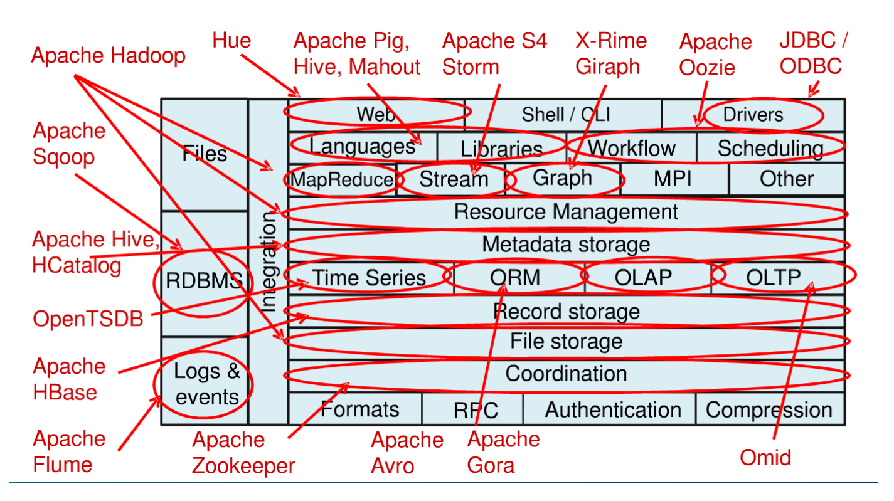

# [토크ON세미나] 아파치 하둡 입문

# 1강 하둡의 탄생과 생태계의 활용
### 하둡을 배워야 하는 이유

- 데이터 홍수의 시대
  - 비정형 데이터를 포함한 빅데이터를 다루기 가장 적절한 플랫폼
 
- 글로벌 하둡 마케의 성장
- 하둡 엔지니어의 수요 증가
  - 데이터 증가로 하둡을 적용하는 기업의 증가
  - 하둡은 2007년 탄생 이후 지속적으로 발전해온 성숙한 기술
  - 하둡 에코시스템은 Governance, Finance, Banking, Insurance, Heathcare 등 사회 전반에 걸친 모든 요소와 밀접하게 연관되어 사용되고 있음

### HADOOP 탄생
> 더그 커팅
- 인덱싱(검색) 라이브러리 'Lucene'
- 'Lucene'의 아들 프로젝트 'Nutch'
  - 웹 검색엔진 프로젝트
- 'Nutch'의 아들 프로젝트 'Hadoop' 탄생
  - 'Nutch'의 분산처리를 지원하기 위해 개발

### 구글 논문과 아파치 프로젝트
 

###   


---

# 2강 하둡 설치
> 리눅스 환경에서 진행
- **intellij 리눅스버전 설치**
  - https://www.jetbrains.com/ko-kr/idea/download/#section=linux
  - 다운받은 후 압축해제 `tar -xvzf ideaIC-2021.3.3.tar.gz`
  - **/opt** 디렉토리로 이동 `sudo mv idea-IC-213.7172.25/ /opt/`
  - `/opt/idea-IC-213.7172.25/bin/idea.sh`로 호출
  - java1.8 버전으로는 오류가 발생해서 jdk11 설치
  - intellij를 실행시키면 터미널이 멈추고 서버에 문제가 생긴다...ㅠㅠ

- **자바 설치**
  - [참고](https://velog.io/@zeesoo/LinuxRHEL7-%EB%A0%88%EB%93%9C%ED%96%87-Oracle-JDK-1.8-%EC%84%A4%EC%B9%98)
  - jdk 1.8 이상
  - **jdk1.8.0_311**을 설치 `tar -zvxf jdk-8u281-linux-i586.tar.gz`
  - `sudo mv jdk1.8.0_281/ /usr/local/lib` -> 모든 사용자가 이용
  - 환경 설정 파일 수정 `sudo vi /etc/profile`
    ```bash
    JAVA_HOME=/usr/local/lib/jdk1.8.0_281
    JRE_HOME=$JAVA_HOME/jre
    PATH=$PATH:$JAVA_HOME/bin:$JRE_HOME/bin
    export JAVA_HOME
    export JRE_HOME 
    ```
  - `source /etc/profile` 로 변경내용 적용
  - `java -version` 으로 설치 확인
    - `-bash: /usr/local/lib/jdk1.8.0_311/bin/java: No such file or directory` 오류 발생
    - [오류 수정](https://askubuntu.com/questions/634024/bash-usr-bin-java-no-such-file-or-directory) : 요약하자면 32비트 라이브러리 일부가 설치되지 않아서 발생
    - `sudo apt-get install libc6-i386`

- **하둡 설치**
  - 3.3 버전
  - 1. 압축풀기
      `tar xvfz hadoop-3.3.0.tar.gz`
    2. 하둡 설정 디렉토리로 이동
      `cd hadoop-3.3.0/etc/hadoop/`
    3. 환경파일(`vi hadoop-env.sh`) 수정
      ```
      export JAVA_HOME=/Library/Java/JavaVirtualMachines/jdk1.8.0_311.jdk/Contents/Home
      export HADOOP_HOME=/Users/hongtebari/Platform/hadoop-3.3.0
      export HADOOP_CONF_DIR=${HADOOP_HOME}/etc/hadoop
      ```
    4. 설정파일 수정 : `vi core-site.xml`
    ```
      <configuration>
        <property>
          <name>fs.defaultFS</name>
          <value>hdfs://localhost:9000</value>
        </property>
      </configuration>
    ```
    5. 설정파일 수정 : `vi hdfs-site.xml`
      ```
      <configuration>
        <property>
          <name>dfs.replication</name>
          <value>1</value>
        </property>
      </configuration>
    ```
    5. SSH 로그인 가능 여부 테스트
      `ssh localhost`
      -> 로그인 되지 않는 경우,
      ```
      ssh-keygen -t rsa -P '' -f ~/.ssh/id_rsa
      cat ~/.ssh/id_rsa.pub >> ~/.ssh/authorized_keys
      chmod 0600 ~/.ssh/authorized_keys
      ```
    6. 하둡 네임노드 포맷
    ```
    bin/hdfs namenode –format
    …
    2020-09-20 14:00:23,053 INFO util.GSet: 0.25% max memory 3.6 GB = 9.1 MB2020-09-20 14:00:23,053 INFO util.GSet: capacity = 2^20 =
    1048576 entries
    2020-09-20 14:00:23,060 INFO metrics.TopMetrics: NNTop conf: dfs.namenode.top.window.num.buckets = 10
    2020-09-20 14:00:23,060 INFO metrics.TopMetrics: NNTop conf: dfs.namenode.top.num.users = 10
    …
    2020-09-20 14:00:23,064 INFO util.GSet: VM type = 64-bit
    2020-09-20 14:00:23,065 INFO util.GSet: 0.029999999329447746% max memory 3.6 GB = 1.1 MB
    2020-09-20 14:00:23,065 INFO util.GSet: capacity = 2^17 = 131072 entries
    Format filesystem in Storage Directory root= /tmp/hadoop-hongtebari/dfs/name; location= null ? (Y or N) Y
    ```


- **하이브 설치**
  - 3.1.2 버전

- maven이란
  - Java 기반 프로젝트의 라이프사이클 관리를 위한 빌드 도구
  - pom.xml 에 필요 라이브러리를 작성하면 알아서 설치해줌(온라인 환경)
    - 오프라인 환경에서는 별도의 전처리 작업이 필요
  
# 3강 하둡 분산파일시스템 이해


# 4강 하둡 맵리듀스 이해


# 5강 하둡 활용
